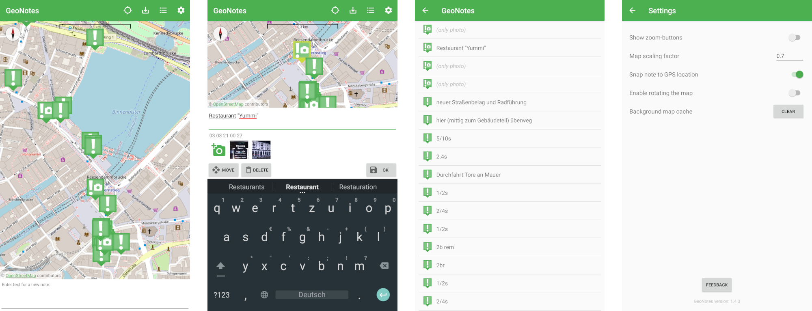

# GeoNotes
A simple app to create and manage georeferences notes on a map. The goal is to create the notes very fast and without any unnecessary UI/UX overhead.

## Get it

## Features

* Create/remove notes
* Move notes
* Store/load notes
* Show current location

## Manual

### Create notes

Just tap on the map, write your text and then tap on "OK".

### Move notes

Select a note (tap on it on the map), tap on "move" and then tap on the map to select the new location. You don't need to tap on save to store the new location.

### Remove notes

Select a note and tap on "remove".

## Ideas

For future features:

* Attach photo to note
