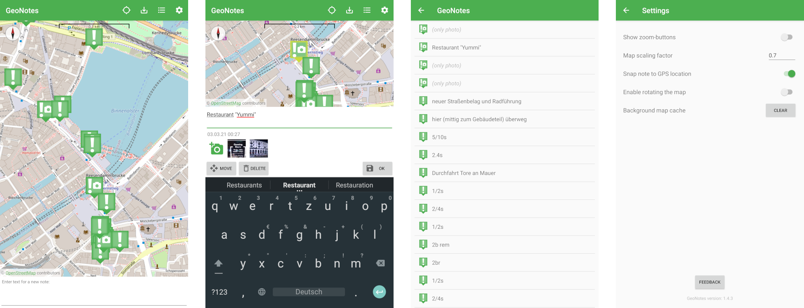

# GeoNotes
A simple and lightweight app to create and manage georeferenced notes (text and photos) on a map. The goal is to create the notes as fast as possible without any unnecessary UI/UX overhead.

By design, GeoNotes does _not_ show or create notes on [osm.org](https://osm.org).
All data is stored exclusively on your local device and no telemetry data is collected.

## Download

GeoNotes runs on Android 8.1 (SDK 27) and newer. There's an [F-Droid version](https://f-droid.org/en/packages/de.hauke_stieler.geonotes/) only, there is _no_ version at the Google Play store.

## Need help?

See the [OSM Wiki page](https://wiki.openstreetmap.org/wiki/GeoNotes) for detailed descriptions about all the features.

## Features

* Create, move and delete notes
* Attach photos to note
* List of all notes
* Organize your notes with categories
* Show and follow current location
* Export all notes in GeoJson or GPX format
* Create and restore full backups
* _No_ data collection (you will _not_ be tracked) and all data is stored on your local device

## Contribute to this project

You want to contribute to GeoNotes? Great! Please read the [CONTRIBUTING.md](CONTRIBUTING.md) file for further information.

## Use-case and Philosophy

### Basic idea of this app

Take notes as fast as possible while being outside (maybe even while walking or sitting in a bus) and later add the data to e.g. OSM.

### Usability principles

To implement the above goal/idea, the app follows some basic principles:

* **Simplicity:** Make creating, editing, moving and deleting of notes as fast/easy as possible.
* **No upload** of data and no creation of notes on osm.org.
* **General purpose:** No restriction in the content of a note.
* **Not a note management tool:** No import, no high level management operations.
* **Simple and pragmatic UI:** No unnecessary animations, no overloaded UIs.
* **Feature toggles:** The possibility to enable/disable features.

### Features which will not be added in the near future

The following features are simply too much work for me right now.
If you want to implement one of these, please follow the instructions in the [CONTRIBUTING.md](https://github.com/hauke96/GeoNotes/blob/main/CONTRIBUTING.md#contribute-code).

* Offline maps
* iOS and other non-android support

### Features which will *not* be added to GeoNotes

These features contradict the idea of GeoNotes and will therefore _not_ be added to GeoNotes.

* Creating notes on osm.org
* Uploading data directly to OSM (see below for apps doing that)
* All sorts of features that will only be used by just a few users but require a lot of work to be implemented

If you need those features, try apps such as [StreetComplete](https://github.com/streetcomplete/StreetComplete), [Every Door](https://every-door.app/) or [OsmAnd](https://osmand.net/) if you want to interact with OSM-data and osm.org notes directly.
